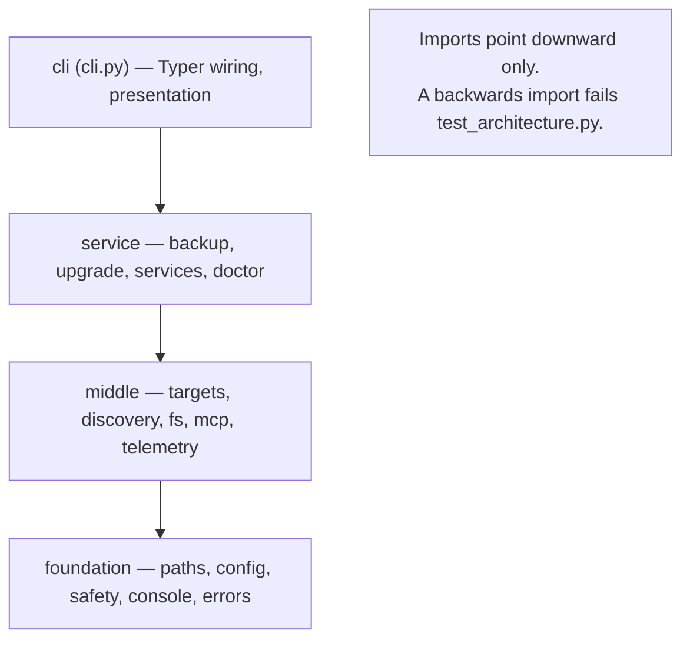

# ADR-0002: CLI module layering (foundation → middle → service → cli)

| Field | Value |
|-------|-------|
| **Status** | Active |
| **Date** | 2026-07-17 |
| **Supersedes** | N/A |

## Context

The `deploy_ai_playbook` CLI grew to ~15 commands across a dozen modules. Without a stated dependency direction, modules drift into cycles and business logic leaks into the Typer presentation layer, making the code hard to test and reason about.

## Decision

Enforce a one-directional layering: **foundation** (`paths`, `config`, `safety`, `console`, `errors`) → **middle** (`targets`, `discovery`, `fs`, `mcp`, `telemetry`) → **service** (`backup`, `upgrade`, `services`, `doctor`) → **cli** (`cli.py`). Lower layers must never import from higher layers. Library layers raise typed errors and stay Rich/Typer-free; presentation lives only in `cli.py`. An AST-based test (`tests/unit/test_architecture.py`) fails the build on any backwards dependency.

## Business Reason

A mechanically-enforced dependency direction keeps the deploy tool testable and safe to change by humans and AI agents alike, without relying on reviewer vigilance.

## Consequences

Easier: unit-testing lower layers in isolation, and keeping presentation out of logic. Harder: a new cross-cutting concern must be placed deliberately in a layer rather than imported ad hoc. We now depend on the architecture test as the guardrail, so it must stay in CI.

---

*Referenced from [`docs/architecture.md`](../architecture.md) § CLI Architecture and enforced by [`tests/unit/test_architecture.py`](../../tests/unit/test_architecture.py).*
