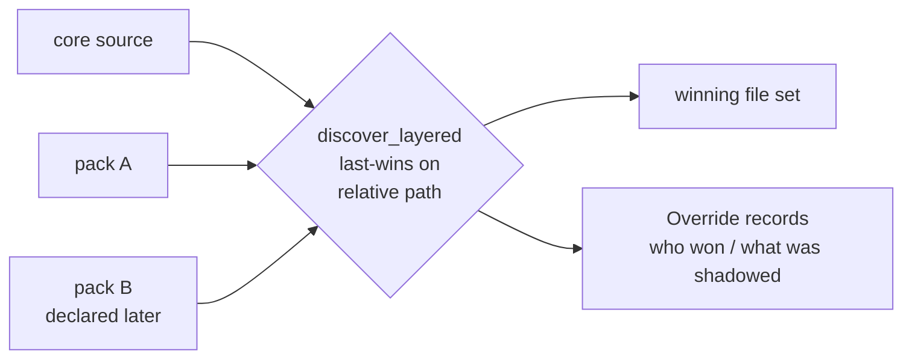

# ADR-0003: Pack overlays resolve last-wins over core

| Field | Value |
|-------|-------|
| **Status** | Active |
| **Date** | 2026-07-17 |
| **Supersedes** | N/A |

## Context

Adopters need to customize agents, knowledge-base files, skills, and templates without forking the playbook. `discover_layered` (`src/deploy_ai_playbook/discovery.py`) merges the core source with zero or more packs, and a rule is needed for what happens when two layers ship the same relative path.

## Decision

Resolve collisions **last-wins**: a pack file overrides core, and a later pack overrides an earlier pack, across the four overlay directories (`agents`, `knowledge-base`, `skills`, `templates`). Every override emits an `Override` record so `deploy`/`doctor` can report exactly which file won and which was shadowed. Layer order is fixed: `core` first, then packs in declared order.

## Business Reason

Last-wins lets teams layer their own standards on top of the playbook predictably, while the override records keep the customization auditable instead of silent.

## Consequences

Easier: adopter customization without forking; transparent reporting of overrides. Harder: pack order now carries meaning, so a mis-ordered pack silently changes the winner. We depend on the `Override` records surfacing in `deploy`/`doctor` output so shadowing is never invisible.

---

*Referenced from [`docs/how-to/write-a-pack.md`](../how-to/write-a-pack.md) and implemented in [`src/deploy_ai_playbook/discovery.py`](../../src/deploy_ai_playbook/discovery.py) `discover_layered`.*
