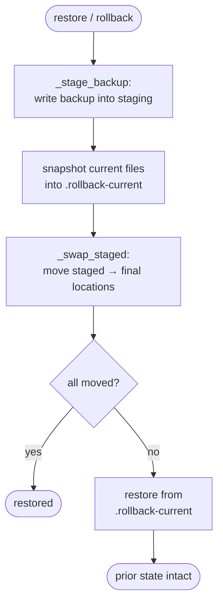

# ADR-0004: Two-phase backup and restore (stage, then swap)

| Field | Value |
|-------|-------|
| **Status** | Active |
| **Date** | 2026-07-17 |
| **Supersedes** | N/A |

## Context

`ai-playbook deploy` overwrites files in a live adopter repo (rules, agents, commands, MCP config). A restore or a mid-deploy failure that partially writes files would leave the repo in a broken, half-deployed state with no clean way back.

## Decision

Restore in two phases (`src/deploy_ai_playbook/backup.py`): first `_stage_backup` writes the backup content into a staging area, then `_swap_staged` moves staged files into their final locations, snapshotting the current files into a `.rollback-current` directory first. If the swap fails partway, the rollback snapshot restores the prior state. Backups record which tool they belong to so rollback selects the right destination set.

## Business Reason

Staging before swapping means a failed restore never leaves the adopter's repo in a half-written state, which is the difference between a recoverable tool and one that can corrupt a working repo.

## Consequences

Easier: safe recovery from a partial failure; tool-scoped rollback. Harder: restore does more filesystem work (stage + snapshot + swap) than a naive copy, and the staging/rollback directories must be cleaned up. We depend on the swap step being the only mutator of final locations so the rollback snapshot stays authoritative.

---

*Implemented in [`src/deploy_ai_playbook/backup.py`](../../src/deploy_ai_playbook/backup.py) (`_stage_backup`, `_swap_staged`); covered by [`tests/acceptance/test_backup.py`](../../tests/acceptance/test_backup.py).*
