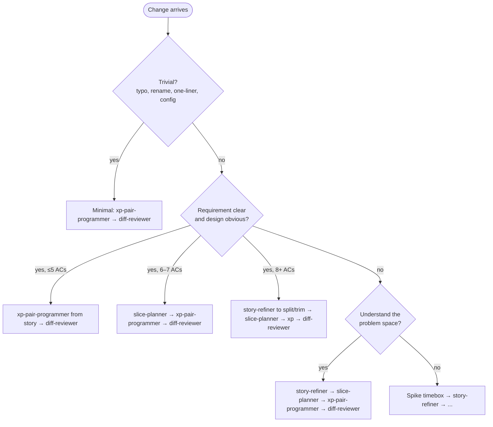

# How To Choose the Right Workflow Path

## Goal

Pick the right agent workflow path for your change: avoid over-ceremony for tiny fixes and under-ceremony for complex features.

## Prerequisites

- AI Playbook deployed in your project
- A change to make: idea, bug fix, feature, or refactor

## Steps

### 1. Assess the Change

Answer these questions in order. Stop at the first match.

| Question | If yes |
|---|---|
| Is the change trivial (typo, rename, one-liner, config)? | Use the minimal path |
| Is the requirement clear with five or fewer acceptance criteria? | Start at xp-pair-programmer |
| Is the requirement clear with six or seven acceptance criteria? | Start at slice-planner |
| Does the story have eight or more acceptance criteria? | Start at story-refiner to split or trim |
| Is the requirement unclear but the domain is familiar? | Start at story-refiner |
| Is the problem space itself unfamiliar? | Run a spike first |

### 2. Use the Decision Tree

```text
Is the change trivial? (typo, rename, one-liner, config)
  └─ YES → Minimal: xp-pair-programmer → diff-reviewer
  └─ NO → Is the requirement clear and the design obvious?
           ├─ YES, ≤ 5 ACs → xp-pair-programmer (from story) → diff-reviewer
           ├─ YES, 6–7 ACs → slice-planner → xp-pair-programmer → diff-reviewer
           ├─ YES, 8+ ACs → story-refiner to split/trim → slice-planner → xp-pair-programmer → diff-reviewer
           └─ NO → Do you understand the problem space?
                    ├─ YES → story-refiner → slice-planner → xp-pair-programmer → diff-reviewer
                    └─ NO  → Spike (timebox) → story-refiner → ...
```

Same routing as a flowchart (the preceding `text` tree is the canonical, contract-synced copy; this diagram mirrors it for quick scanning):



### 3. Default to the Full Workflow Path When Unsure

Use the full workflow path (story-refiner → slice-planner → xp-pair-programmer → diff-reviewer, then release-captain to ship) unless **all** of these are true:

- The change is tiny and isolated.
- The expected outcome is obvious in one sentence.
- No open product, domain-language, or design questions remain.
- No new boundary, integration, or architectural decision is involved.
- Blast radius is low enough to validate from the diff alone.

### 4. Run a Spike for Unknowns

When you need to learn before deciding:

1. Agree on a timebox with the team.
2. Explore freely: no TDD, no production code on `main`.
3. Capture findings in `research/RESEARCH-NNN-spike-topic.md`.
4. Decide: write a story from the findings, or discard.

Spike code is throwaway and never committed to `main`.

### 5. Use the Fast Lane for Urgent Small Fixes

For work that is urgent but not an active incident: the user says "asap" / "hotfix", or the story carries `priority: high` or `critical`: and the scope is small (≤ 3 points), run the same chain with prompts compressed:

- **story-refiner**: classify and write the story with zero non-material questions; record assumptions instead of asking (`CLAUDE.md` § Shared Rules, Prompt minimization). One preview gate as usual.
- **slice-planner**: use the small-story shortcut (append `## Implementation` to the story); skip design-options ceremony when one path is viable. One preview gate.
- **xp-pair-programmer**: default to **low-prompt mode**: log RED failures and continue rather than waiting for acknowledgment; comprehension and teach-back checkpoints fire only on real triggers.
- **Gates that always remain:** one preview per artifact, commit approval, merge approval, push approval. The fast lane compresses *pauses*, never *gates*.
- **Not for active incidents.** SEV1/SEV2 production issues go to **incident-responder** first (`knowledge-base/incident-response.md`); the fast lane is for urgent-but-not-on-fire fixes. Ship outside normal cadence on a `hotfix/` branch (`knowledge-base/release.md` § Hotfix).

## Troubleshooting

| Symptom | Likely cause | Fix |
|---|---|---|
| Thin plan for a complex feature | Started at slice-planner without story-refiner | Refine the story first |
| Excessive ceremony for a one-liner | Used the full workflow path for a trivial change | Use the minimal path: `xp-pair-programmer → diff-reviewer` |
| Urgent small fix drowning in prompts | Fast lane not engaged | Set `priority: high`/`critical` or say "fast lane": see § 5 |
| Building the wrong thing | Skipped story-refiner with unclear requirements | Stop, refine the story, then restart |

## Related

- [User Guide § The Loop](../user-guide.md#3-the-loop): overview of all workflow paths
- [Invoke Agents](invoke-agents.md): how to start each agent
- [Architecture § Agent Handoff Workflow](../architecture.md#agent-handoff-workflow): how agents hand off through artifacts
